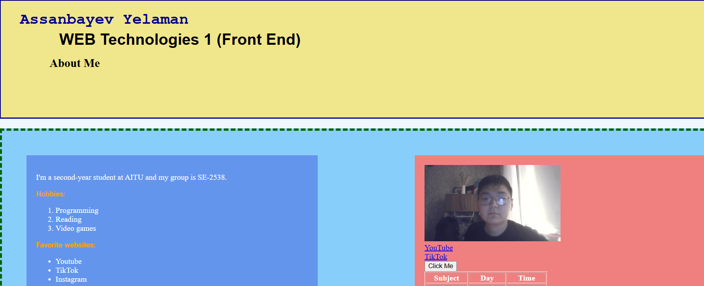
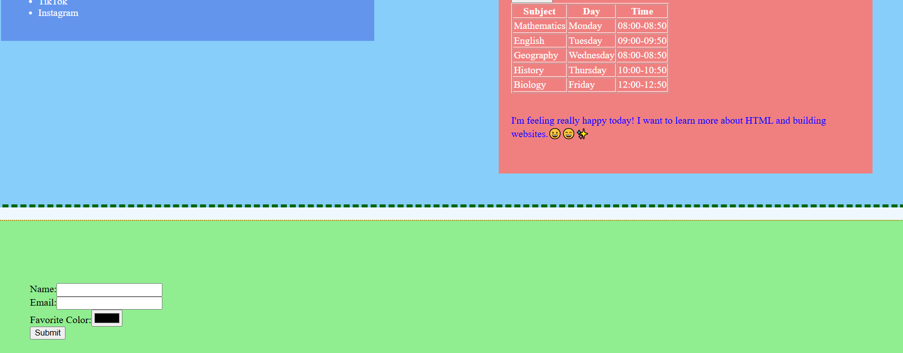
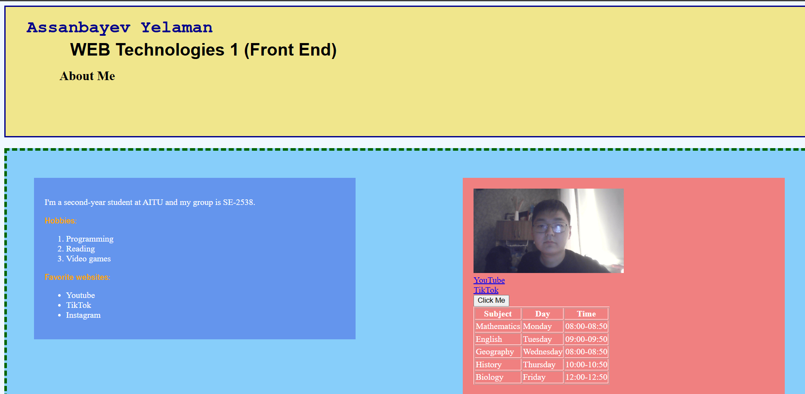
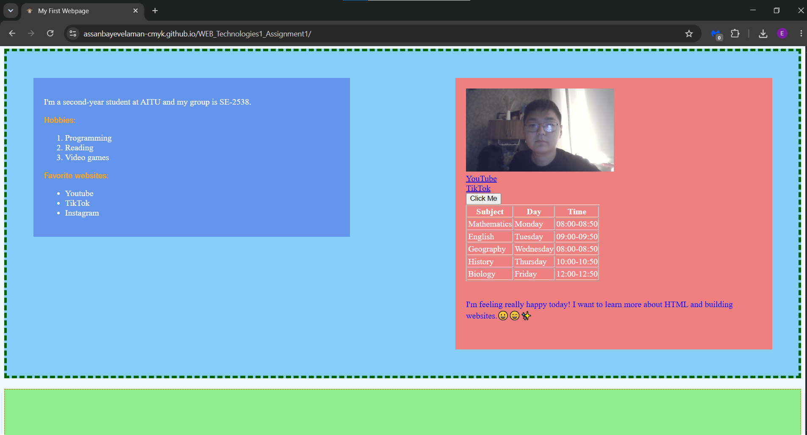
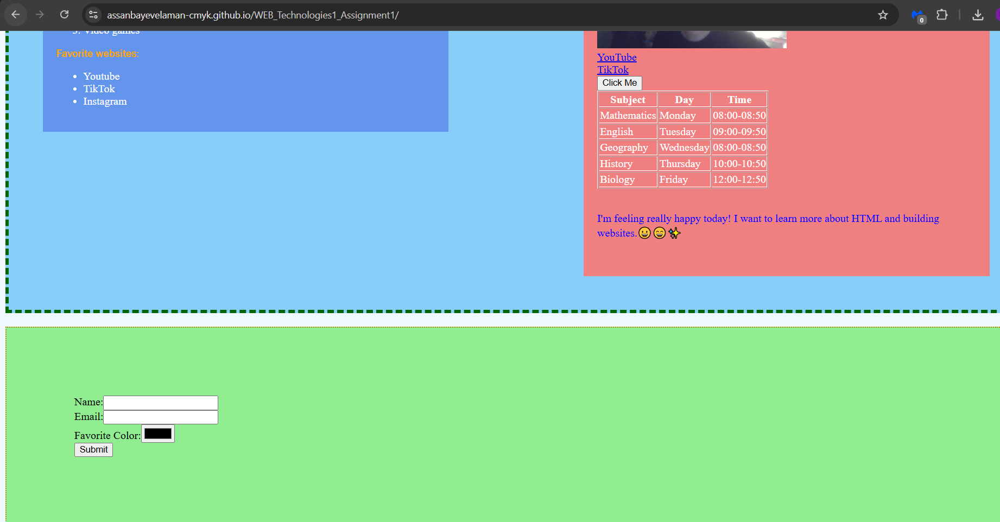

# WEB_Technologies1_Assignment1

**Name:** Assanbayev Yelaman
**Group:** SE-2538
**Course:** WEB Technologies 1 (Front End)

---

## Part 1. Introduction to HTML

- **Step 0:** Created `index.html` with the basic HTML boilerplate, titled "My First Webpage".
- **Step 1:** Added headings (`<h1>`-`<h3>`) with my name, course, and "About Me", plus a short paragraph.
- **Step 2:** Created an ordered list of hobbies and an unordered list of favorite websites.
- **Step 3:** Inserted my photo with `` and added two clickable links.
- **Step 4:** Added a "Click Me" button.

> 

---

## Part 2. Intermediate HTML

- **Step 5:** Created a 3-column table (Subject/Day/Time) with a weekly schedule.
- **Step 7:** Added a paragraph with 3 emojis about my mood.
- **Step 8:** Created a form with Name (text), Email, Favorite Color, and a Submit button.

> 

---

## Part 3. Introduction to CSS

- **Steps 9-12:** Applied CSS inline (one paragraph), then internal, then moved all rules into an external `style.css` linked with `<link>`.
- **Step 13:** Used element selectors (`body`, `h2`, `h3`), a class selector (`.highlight`), and an ID selector (`#main-heading`) with different colors and fonts.
- **Step 14:** Applied `.highlight` to multiple elements and `#main-heading` to the main `<h1>`.

> 

---

## Part 4. Intermediate CSS

- **Step 15:** Added a favicon with `<link rel="icon" ...>`.
- **Step 16:** Grouped content into `#header`, `#main-content`, and `#footer` divs, each with background color and padding.
- **Step 17:** Applied padding, borders, and margins to multiple elements.
- **Step 18:** Demonstrated `static`, `relative`, and `absolute` positioning.
- **Step 19:** Used `px`, `%`, `em`, and `rem` units on headings and images.
- **Step 20:** Created a float layout with `.box-left` and `.box-right`, fixed with `.clear-fix { clear: both; }`.
- **Step 21:** Published the site with GitHub Pages.

> 

> 

---

## Summary of Work Process

I built the page step by step: first the HTML content, then styling with CSS. I then added layout features (divs, box model, positioning, float/clear). Finally, I uploaded everything to GitHub and published it with GitHub Pages.
